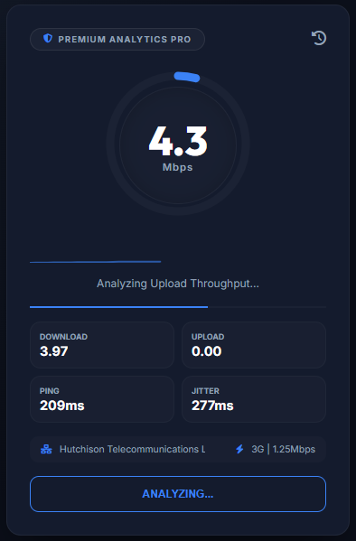

# Internet Speed Test | Premium Analytics Pro

A high-performance, professional-grade network diagnostic suite designed for precision and speed. This application provides a comprehensive analysis of internet connectivity through advanced measurement algorithms and real-time data visualization.

  

## Overview

Premium Analytics Pro is a minimalist, developer-centric tool built to provide accurate network performance metrics. Unlike standard speed tests, this suite utilizes multi-threaded data fetching and real-time stability tracking to deliver a technical breakdown of connection quality.

## Core Features

### Turbo Measurement Engine
- **Multi-threaded Download Analysis**: Utilizes parallel connection streams to saturate high-speed bandwidth for more accurate throughput measurement.
- **Upload Throughput Testing**: Dedicated phase for measuring data transmission speeds using optimized binary payloads.
- **Latency & Jitter Tracking**: High-precision measurement of network response times and stability fluctuations.

### Real-time Visualization
- **Live Sparkline Graph**: Dynamic SVG-based graphing engine that visualizes speed fluctuations in real-time during the diagnostic phase.
- **Performance Gauge**: A sophisticated minimalist interface showing instantaneous speeds and connection quality.
- **Interactive Result Cards**: Detailed breakdown of Ping, Jitter, Download, and Upload metrics.

### Network Intelligence
- **ISP & IP Discovery**: Automated detection of internet service provider information and public IP addresses via secure APIs.
- **Connection Type Detection**: Utilizes the Network Information API to identify signal types (e.g., WiFi, 4G, Ethernet).
- **Persistent Local History**: Securely stores the last 10 test results locally for performance tracking over time.

## Technical Implementation

- **Architecture**: Lightweight Vanilla JavaScript (ES6+) core with zero external dependencies.
- **Styling**: Modern 'Carbon & Steel' minimalist theme using custom CSS3 variables and glassmorphism principles.
- **Performance**: Optimized for speed with parallel request handling and non-blocking UI updates.
- **Reliability**: Fault-tolerant measurement engine with automated safety timeouts for all network operations.

## Deployment

The application is optimized for static hosting environments and is currently deployed via Vercel.

Live Preview: [https://internet-speed-test-psi.vercel.app/](https://internet-speed-test-psi.vercel.app/)

## Developer

**Adheesha Sooriyaarachchi**

## License

This project is licensed under the MIT License.
